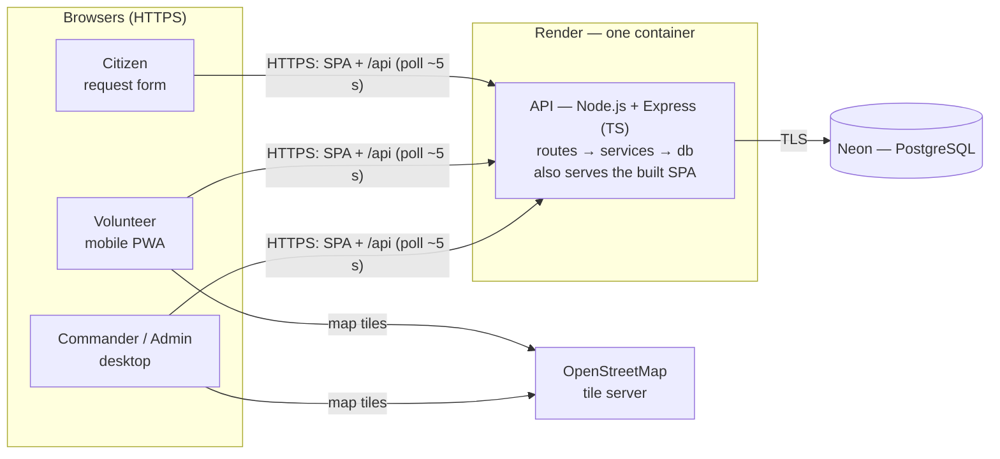
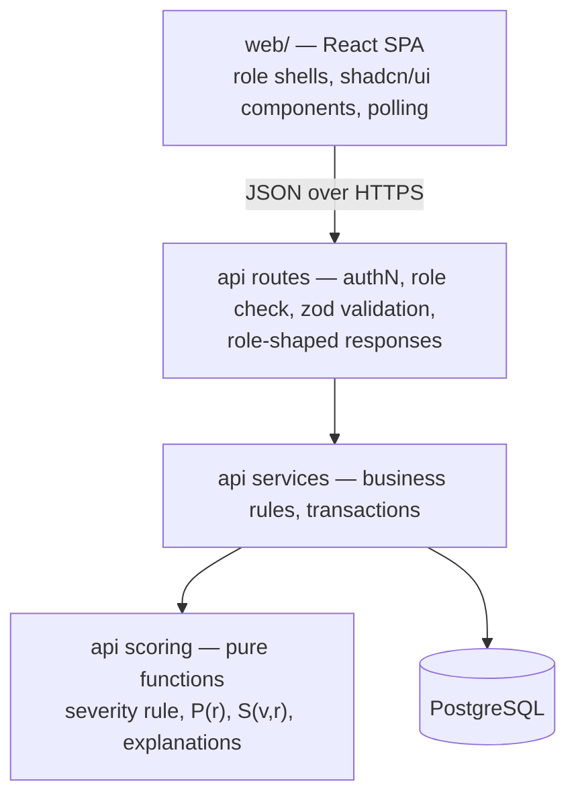
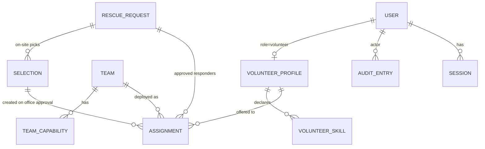
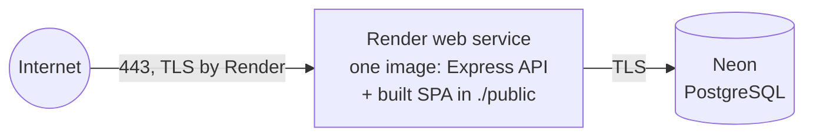

# Architecture

> **State (2026-09-18): the shape exists, the behavior does not.** The deployable pieces below are real and run: one image holding the Express API with the built SPA inside it, plus PostgreSQL. Verified on 2026-09-18 serving the SPA, `/api/health` and the SPA fallback route from a single origin. Everything that makes RescueAI *work* is still **planned**: no database tables, no routes beyond health, no scoring, no auth. Sections about the data model, API areas, data flow and security describe what will be built in Phases 2-5 (`PLAN.md`).
>
> Each decision is labeled:
> - **Decided:** explicitly chosen by the product owner.
> - **Proposed:** the architect's recommendation, not yet confirmed.
> - **Not established:** open.
>
> Update this file in the same change as any major architectural change. When code lands, replace "planned" with what actually exists.

Scope and behavior are defined in `PRD.md`, UI rules in `DESIGN.md`, and agent rules in `AGENTS.md`. This file covers **how** the system is built.

## System Overview

RescueAI MVP is a **single web application** with three parts:
- a React single-page app (SPA) that serves all five roles (Citizen, Volunteer, On-site Commander, Office Commander, Admin)
- one Node.js/Express API in TypeScript
- one PostgreSQL database

The API and the built SPA ship as one container on a managed host, with PostgreSQL alongside it. HTTPS is terminated by the host.

The API does most of the work:
- it computes request priority (PRD Eq. 4.2) and responder ranking (Eq. 4.1) with deterministic formulas, not ML
- it enforces role-based access
- it guarantees that no offer or deployment happens without a logged on-site commander selection and a logged office commander approval

Clients receive updates by polling.

## System Diagram

Planned MVP:



Future components (not part of the MVP; see PRD "Future Features") would sit behind the API:
- a Python ML/RAG service
- a routing engine
- a graph store
- a vector store
- weather and push-notification providers

## Tech Stack

| Area | Choice | Status |
|---|---|---|
| Frontend | React, Tailwind CSS, shadcn/ui | Decided |
| Frontend build | Vite | Decided |
| Frontend server state | TanStack Query (polling via `refetchInterval`) | Decided |
| Maps | Leaflet with OpenStreetMap tiles | Decided |
| Translations (citizen and volunteer screens) | Plain TypeScript dictionaries for `en` and `hi`, no i18n library | Decided |
| Backend | Node.js + Express, TypeScript (strict) | Decided |
| Request validation | zod schemas at the API boundary | Decided |
| Database | PostgreSQL (no PostGIS in MVP) | Decided |
| DB access / migrations | Drizzle ORM + drizzle-kit | Decided |
| Auth | Server-side sessions in PostgreSQL, httpOnly cookie, bcrypt password hashing | Decided |
| Live updates | Client polling every ~5 s | Decided |
| TLS and routing | Terminated by the host (Render). The API serves the SPA from the same origin. | Decided (D-044) |
| Deployment | Render free web service (Docker), Neon free PostgreSQL. Docker Compose is the local stack. | Decided (D-044) |
| Package manager / tests / lint | npm, Vitest, ESLint + Prettier | Decided |

## Repository Structure

**Existing** (the layout below was created on 2026-09-18; the `routes/`, `services/` and `scoring/` directories are empty):
```
PRD.md  DESIGN.md  AGENTS.md  CLAUDE.md  ARCHITECTURE.md  RULES.md
TESTING.md  PLAN.md  MEMORY.md  DECISIONS.md      (repository root)
web/                 React SPA (all roles, route-based role shells per DESIGN.md)
  src/index.css      Design tokens from DESIGN.md
  src/components/ui/ shadcn/ui components (shadcn CLI)
  src/lib/           small pure helpers
api/                 Express API (TypeScript)
  src/app.ts         the Express app: /api/health, 404 and error handler
  src/routes/        HTTP handlers: auth middleware, validation, response shaping (empty)
  src/services/      Business rules: requests, volunteers, teams, recommendations, decisions, assignments, audit, admin (empty)
  src/scoring/       Pure functions for Eq. 4.1 and 4.2 and the severity rule, no I/O (empty)
  src/db/            Drizzle client and schema; migrations output to api/drizzle/
docker-compose.yml   app + db, building the same Dockerfile Render deploys
Dockerfile           Builds the SPA and the API into one image (the deployed unit)
render.yaml          Render service definition; DATABASE_URL is set in the dashboard
.github/workflows/   CI: lint, type-check, tests on every pull request
```

There is no shared package between `web/` and `api/` at the start. Add one only when duplicated types actually cause bugs.

## Application Layers



- **Routes** handle HTTP concerns only: authenticate, authorize the role, validate input, and shape the output for the caller's role.
- **Services** own the business rules and database transactions.
- **Scoring** is pure and deterministic. It takes plain data plus weights and returns scores and per-feature contributions. It never reads the database or the clock itself; the caller passes in "now".

## Database Architecture

This is a single PostgreSQL database. The planned entities (derived from PRD F1–F14) are listed below. The exact schema will live in migrations once they exist.



- **USER:** role (volunteer / onsite_commander / office_commander / admin), credentials, active flag. Citizens have no user row.
- **VOLUNTEER_PROFILE:** availability, last-known latitude/longitude with timestamp, reliability counters.
- **VOLUNTEER_SKILL:** skill and status (Unverified / Verified / Rejected), plus who verified it.
- **RESCUE_REQUEST:** citizen fields (PRD F1), auto and overridden severity, status, and the evaluation timestamps (PRD F14).
- **ASSIGNMENT:** one responder (volunteer or team) on one request, with offer status and timestamps.
- **SELECTION:** the responders an on-site commander chose for one request, the required skills used, and a status (awaiting approval / approved / sent back). It records who selected, who approved or sent back, and when. Assignments are created only when a selection is approved (PRD F9). It does **not** copy the explanation snapshot; that lives in the audit entry alone (D-042).
- **Location request (PRD F2):** the latest "share your location" request is an actor and a timestamp on the settings row, not a table (D-042). A volunteer sees the banner while their own location timestamp is older than that time, and the audit log keeps the history.
- **SCORING_WEIGHTS (the settings row):** w1–w4, α, β, γ, plus the latest location-request actor and time. Editable by the Admin (PRD AC10). Each weight group must sum to 1, checked with zod in the API — no database CHECK constraint, because floating-point sums make it fragile and only the Admin writes this row (D-042).
- **AUDIT_ENTRY:** actor, action, target, timestamp, and a JSON snapshot of the recommendation and explanation that was shown. **Append-only.**

**Rules:**
- **All timestamps are stored in UTC** (`timestamptz`) and rendered in IST in the UI and in CSV exports (D-041). The Wait term, the evaluation timestamps and SM1 all depend on this.
- **Location is stored as plain latitude/longitude columns.** MVP proximity is straight-line (haversine) distance computed in `scoring/`. PostGIS is added only when a Future spatial feature needs it.
- **The audit log is append-only at the database level (Decided).** The application's DB role gets `INSERT` and `SELECT` only on the audit table. Any action that must be audited writes its audit row **in the same transaction** as the action.
- **Constraints belong in the database.** Enum-like statuses and "one active assignment per responder" (PRD F10, confirmed 2026-09-15) are enforced with database constraints, not only in application code.

## API Architecture

The API is JSON over HTTPS under `/api`. It serves the SPA itself, from the same origin, so no CORS is needed and the session cookie stays `SameSite=Lax`.

Resource areas and who may call them (planned; the exact routes will be defined in code):

| Area | Callers |
|---|---|
| Public request submission (PRD F1) | Anyone. No auth, rate-limited. |
| Auth: login, logout, current session | All users |
| Volunteer self-service: profile, skills, availability and location, offers, completion | Volunteer (own data only) |
| Queue, request detail, severity override, recommendations | On-site and office commanders |
| Level-1 decisions: select / modify / reject | On-site commander |
| Level-2 decisions: approve / send back | Office commander |
| Skill verification, teams, map data, location request, audit log | On-site and office commanders (audit log also Admin) |
| Commander accounts, weights, scenario load, CSV export (no phone numbers or locations) | Admin |

**Conventions:**
- Validate every request body and query string with zod at the route level (Decided).
- Errors use one JSON shape (Decided, D-035): `{ "error": { "code", "message", "fields"? } }`. `code` is a stable machine-readable string, so citizen and volunteer screens can show a translated message; `message` is human-readable English; `fields` carries per-field validation messages. Responses never include stack traces.
- Polling endpoints return the current state of the list or record. The client re-fetches every ~5 s while the screen is open.

## External Services

**MVP:**
- **OpenStreetMap tile server** (map display only).
  - The public `tile.openstreetmap.org` usage policy allows light use only. That's fine for a demo; heavy use needs a different tile provider.
- **Browser Geolocation API** (a platform API, not a vendor). It requires HTTPS.

The MVP has no SMS, push notification, LLM, routing or weather service.

**Future** (PRD Future Features, not built):
- OSRM or OpenRouteService for routing
- IMD weather feeds
- Firebase Cloud Messaging (FCM) for push notifications
- an LLM plus vector store for RAG
- Neo4j for the knowledge graph

## Data Flow

The core loop (PRD UF1, UF3, UF4):

```mermaid
sequenceDiagram
  participant Cit as Citizen
  participant Cmd as On-site Commander
  participant Off as Office Commander
  participant Vol as Volunteer
  participant API
  participant DB as PostgreSQL

  Cit->>API: POST request (no auth)
  API->>API: validate, severity rule
  API->>DB: insert request (submitted_at)
  API-->>Cit: reference ID

  loop every ~5 s
    Cmd->>API: GET queue
    API->>DB: pending/in-progress requests + weights
    API->>API: P(r) per request (scoring)
    API-->>Cmd: sorted queue with components
  end

  Cmd->>API: GET recommendations(request)
  API->>DB: eligible volunteers/teams, weights
  API->>API: S(v,r) + contributions (scoring)
  API->>DB: record first_recommended_at
  API-->>Cmd: shortlists + explanations

  Cmd->>API: POST selection (selected responders)
  API->>DB: BEGIN; insert selection (awaiting approval) + audit entry; COMMIT
  API-->>Cmd: ok

  loop every ~5 s
    Off->>API: GET selections awaiting approval
  end
  Off->>API: POST approval (selection)
  API->>DB: BEGIN; mark selection approved, insert assignments + audit entry; COMMIT
  API-->>Off: ok

  loop every ~5 s
    Vol->>API: GET my offers
  end
  Vol->>API: accept / decline / complete
  API->>DB: BEGIN; update assignment, request status, reliability counters + audit entry; COMMIT
```

Scores are **computed when they're read**, from current data and current weights. They are not stored, so a weight change applies immediately (AC10). The one exception: the snapshot of what the commander saw is stored in the audit entry.

## Architectural Patterns

- **Layered monolith:** routes → services → scoring/db, deployed as one API. At this team size and deadline, one deployable is the cheapest option to build, test and run.
- **Pure scoring core:** all ranking logic lives in pure functions. The PRD acceptance criteria about ranking (AC3, AC5, AC8, AC9) can then be checked with plain unit tests, with no database or server.
- **Transactional audit:** every audited action and its audit row commit together, or neither does.
- **Role-shaped responses:** the API decides which fields each role receives. The UI never receives data it must hide.
- **Polling instead of push:** stateless servers and no connection management. This is acceptable at prototype scale.

## System Boundaries

| Boundary | Why it exists |
|---|---|
| **Browser ↔ API** | All authorization and personal-data filtering (AC14, AC18) happens server-side. Hiding something in the UI is not security. |
| **Public request endpoint** | The only unauthenticated write. It is validated strictly and rate-limited, because anyone on the internet can call it. |
| **Decision service** | This is the **only** code path that creates offers or deployments. It creates them only when an office commander approves a selection made by an on-site commander, and it writes each step's audit entry in the same transaction as that step. It is the enforcement point for "no dispatch without two-level approval" (AC11, AC22, SM4). |
| **Audit table** | Append-only is enforced by database permissions, so AC17 holds even if the application has a bug. |
| **Scoring module** | Pure and deterministic, so it is testable and explainable. A Future learning-to-rank or severity model can replace a function here without changing routes or the UI. |
| **Future ML/RAG service** | Future Python ML and RAG will run as a **separate service** behind the API. The MVP stays TypeScript-only, and Python dependencies never block it. |

## Scalability Considerations

The target is prototype scale: a few commanders, hundreds to low thousands of synthetic volunteers, and tens of active requests.

- **Polling:** each open screen makes about one request every 5 seconds. For example, 50 open screens is roughly 10 requests per second, which one Node process handles easily.
  - Upgrade path: switch to Server-Sent Events if polling load or latency becomes a problem.
- **Ranking:** each request scans all eligible responders in memory, so it grows linearly with the number of responders. That's fine at this scale.
  - Upgrade path: pre-filter with a bounding box in SQL, then PostGIS with a spatial index.
- **Single container, free tier:** there is no redundancy, and the service sleeps after ~15 minutes idle. That is acceptable for a demo and is not production-grade (see PRD Non-Goals: no field deployment).
  - Upgrade path: a paid Render instance removes the sleep; nothing about the image changes.
- Horizontal scaling is **not a goal**. Server-side sessions in PostgreSQL would not block adding more API instances later.

## Security Architecture

The rules are defined in `AGENTS.md` → Security Requirements. This section covers how they are implemented. Everything here is Decided.

- **Transport:** HTTPS everywhere, with TLS terminated at the proxy. HTTPS is also *required* for browser geolocation and for installing the PWA.
- **Authentication:**
  - Server-side sessions stored in PostgreSQL, referenced by an httpOnly, Secure, SameSite cookie. Nothing token-like is stored in JavaScript.
  - Users log in with a phone number and password. Passwords are at least 8 characters, and a session lasts 12 hours (D-037).
  - Deactivating a commander deletes their sessions, so access is revoked immediately.
- **Passwords:** hashed with bcrypt.
- **Authorization:** role-check middleware on every non-public route, plus ownership checks (for example, a volunteer can reach only their own offers).
- **Personal data:** citizen phone numbers and volunteer coordinates are included only in commander responses. Volunteer and Admin responses, audit snapshots and CSV exports never contain them. A volunteer still receives their own location.
- **Input:** zod validation on every route, and parameterized SQL only.
- **Abuse:** the public submission endpoint is rate-limited to 30 requests per 10 minutes per IP (D-036). The limit is deliberately generous, because Indian mobile carriers put many users behind one shared IP and a strict limit would block real citizens during a disaster.
- **Secrets:** supplied through environment variables and never committed.
- **Audit integrity:** the database role cannot update or delete audit rows.

## Deployment Architecture

Decided (D-044): a **Render** free web service running one Docker image, with **Neon** free PostgreSQL. Free tiers, because the project must stay reachable until the Phase-II Examination in May 2027 and has no hosting budget.



- **One image, one origin.** `Dockerfile` builds `web/` and `api/` and copies the SPA build to `./public`. Express serves those static files and falls back to `index.html` for any non-`/api` GET. Nothing is cross-origin, so no CORS and no `SameSite=None` cookie — which matters, because mobile Safari blocks third-party cookies and would break login on a phone.
- **Render terminates TLS** and gives the service an HTTPS subdomain. A custom domain is still Not established.
- **Neon, not Render PostgreSQL.** Render's free database is deleted after 30 days; Neon's free tier persists. It sits outside the VM boundary the earlier design assumed, so `DATABASE_URL` uses TLS.
- **The free service sleeps after ~15 minutes idle**, with a cold start of roughly 50 seconds. This is a measurement hazard, not just a demo annoyance: the SM1 timing runs in Phase 6 must warm the service first, or the median will include a cold start.
- **`docker-compose.yml` builds the same `Dockerfile`**, so local and deployed behavior match. It serves `http://localhost:3000`, which browsers treat as a secure context, so geolocation and PWA install work locally without TLS. Real-phone checks (AC21, AC24) use the deployed HTTPS URL.
- CI: GitHub Actions runs lint, type-check and the test suite on every pull request (D-039), defined in `.github/workflows/ci.yml`. First green run 2026-09-18. Deployment is Render's automatic build on push to `main`.
- Not established: the database backup strategy (Neon has its own retention; a scheduled `pg_dump` is still recommended) and the domain name.

## Architecture Decisions

This table is a quick index. The full records (context, options, trade-offs, what was rejected) are in **`DECISIONS.md`**. When a decision changes, add a new entry there first, then update this row.

| ID | Decision | Status | Rationale |
|---|---|---|---|
| AD1 | Responsive web app + PWA, no native app | Decided | PRD; one codebase |
| AD2 | React + Tailwind + shadcn/ui | Decided | DESIGN.md; accessible primitives |
| AD3 | Node.js + Express, TypeScript | Decided | One language for a 3-person team; matches the synopsis |
| AD4 | PostgreSQL, no PostGIS in MVP | Decided | Relational data plus an enforceable audit log; straight-line distance needs no GIS |
| AD5 | Polling every ~5 s for live updates | Decided | Meets AC2 (10 s) with no extra infrastructure |
| AD6 | Render free web service + Neon free PostgreSQL; one image serving the API and the SPA from one origin | Decided (D-044, supersedes the one-VM plan) | No hosting budget; same-origin keeps the session cookie working on phones |
| AD7 | Formula-based scoring, no ML in MVP | Decided | PRD; ML is a Future feature |
| AD8 | Scoring as pure functions; a single decision service creates offers and deployments | Decided | Testable ACs; one enforcement point for AC11 |
| AD9 | Server-side sessions + httpOnly cookie | Decided | Immediate revocation; no tokens in JS (synopsis listed JWT) |
| AD10 | DB-level append-only audit + same-transaction writes | Decided | Guarantees AC11/AC17 even if the app has a bug |
| AD11 | Future ML/RAG as a separate Python service | Proposed | Keeps the MVP single-language |
| AD12 | Vite, Leaflet, zod; `web/` + `api/` layout | Decided | Standard, minimal choices for the decided stack (Caddy dropped by D-044) |
| AD13 | Drizzle ORM + drizzle-kit, TanStack Query, npm, Vitest, ESLint + Prettier | Decided | Typed DB access with editable SQL migrations; polling built into TanStack Query; one tool per job (see `RULES.md`) |
| AD14 | Two-level approval: on-site selection, then office approval; assignments created only on approval (D-030) | Decided | Owner requirement matching the field-and-office chain of command |
| AD15 | Citizen and volunteer screens translated with plain `en`/`hi` dictionaries, no i18n library (D-033, D-040) | Decided | Two languages don't need a library; avoids a new dependency |

## Constraints

- **Timeline:** a deployed prototype plus evaluation by January 2027, and a demo site kept running until the Phase-II Examination in May 2027. Built by a team of 3 (see PRD and `PLAN.md`).
- **Hosting:** free tiers only (Render + Neon), and the app must fit a free Render instance. The PRD's ~2 vCPU / 4 GB figure came from the synopsis and is now an upper bound, not a target.
- **HTTPS is mandatory:** geolocation and PWA installation only work in a secure context.
- **Scope:** only PRD features F1–F14. No component in this file may be built for a Future feature without a PRD update.
- **External usage:** OSM tile usage must stay within the public tile server's policy.
